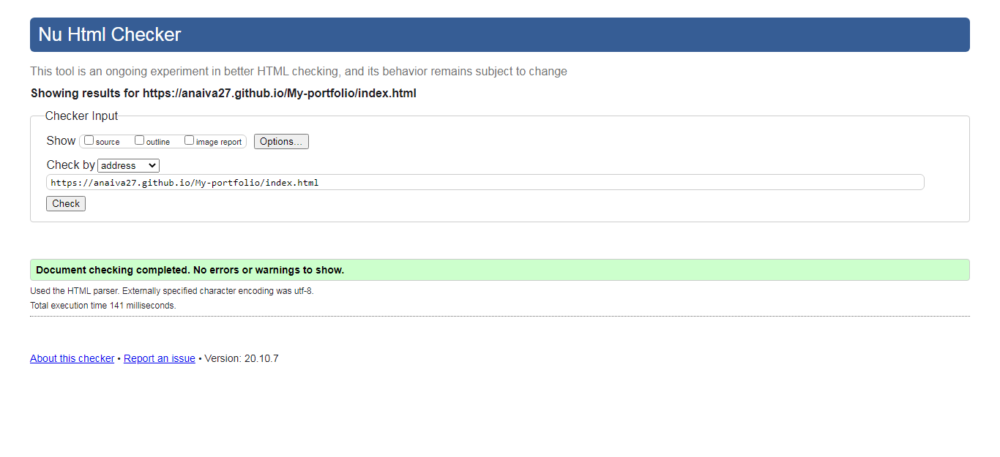
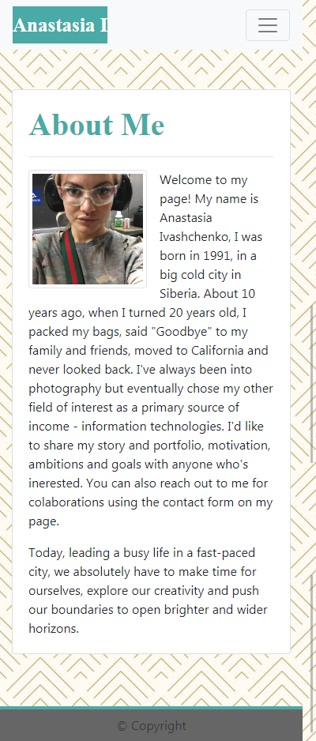
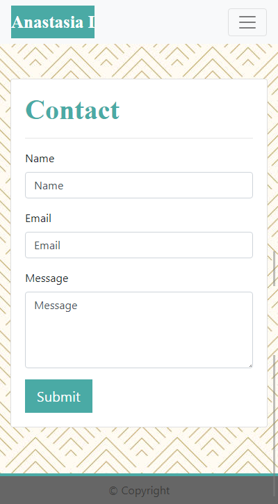
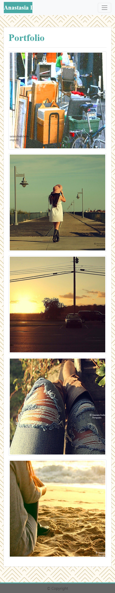
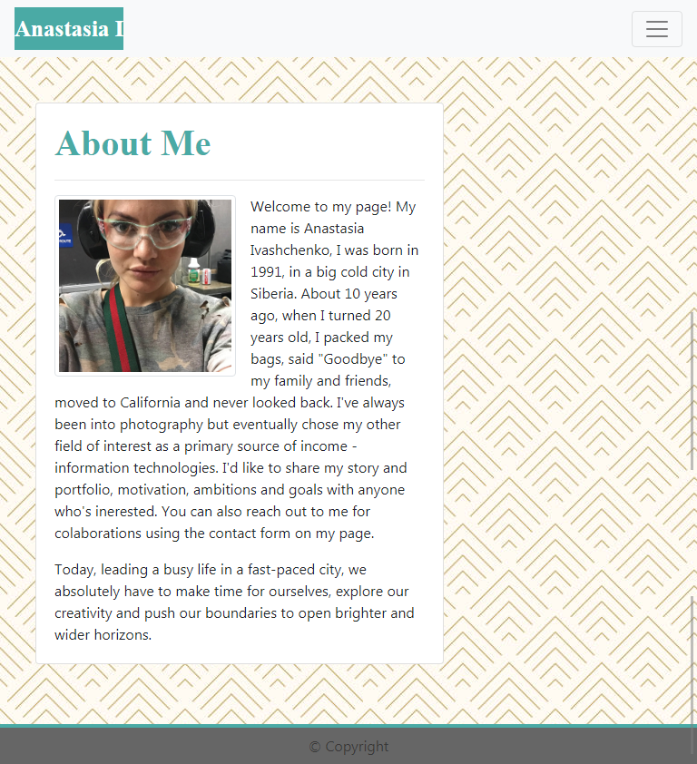
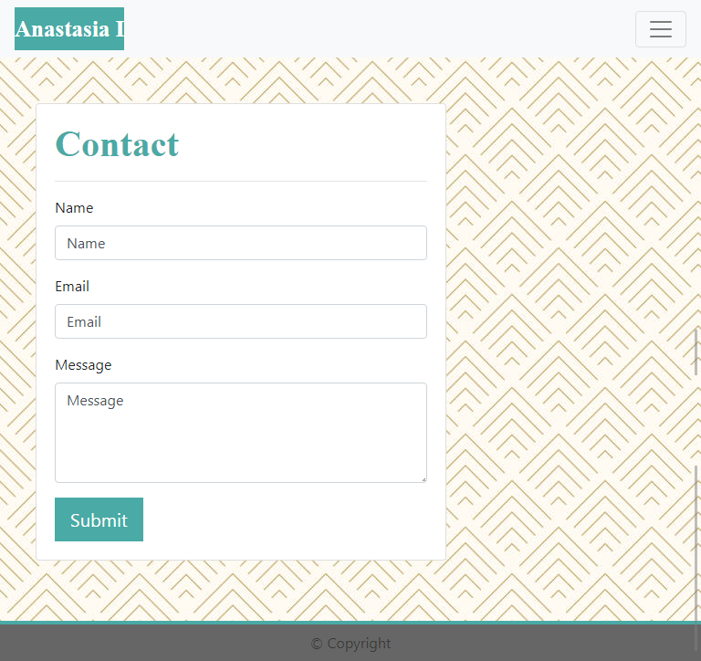
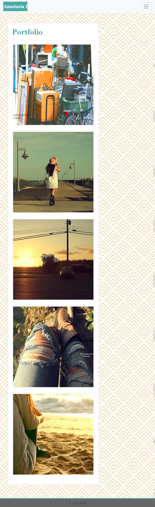
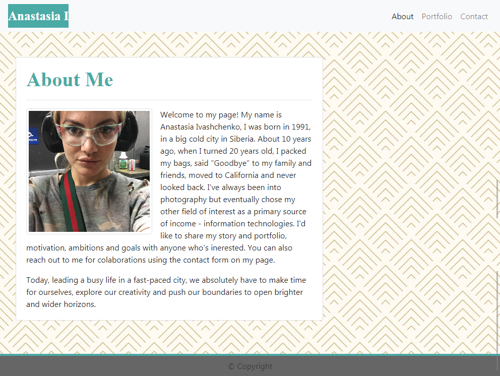
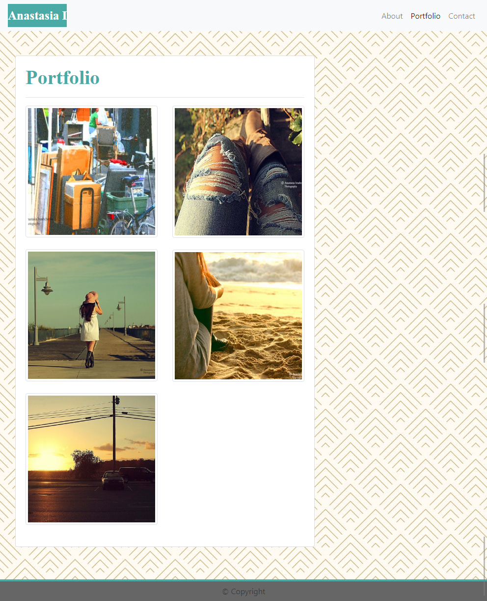

# Responsive portfolio

## Description 

Create a responsive portfolio, using Bootstrap CSS Framework and provided screenshots. The website must have a navbar, responsive layout and
responsive images, with valid semantic html, and personalized information.

## Table of Contents

* [Installation](#installation)
* [Usage](#usage)
* [Credits](#credits)

## Installation

Meta tags, JavaScript plugins and links to the Bootstrap CSS Framework were added to the `<head>` and `<body>` of the website for succesful implementation of the task. Also, the developer tools were used and the Full Page screenshot Google Chrome extension was installed to capture the pages at the breakpoints (400px, 768px, 992px).

## Usage

First, to create a responsive light-themed navbar that automatically collapses at the large breakpoint (992px), we used following classes:
`navbar navbar-expand-lg sticky-top navbar-light bg-light`. It also made the navbar to stick to the top of the page.
We used Bootstrap grid system such as containers, rows and columns to layout and align content. A flexible and extensible content container Card was used to store a photo gallery, contact form and the headshot with the legend on the landing page. Margins were added to the main container to make sure that it doesnt stick to the navbar or the footer, that is dark-themed, with a blue 4px border on top and fixed at the bottom of the page. Classes used for that: `fixed-bottom mt-auto background`.
Semantic tags `<nav>,<section>,<main>,<footer>` were utilized to ensure the accessibility of the website. In the contact form, attribute `aria-label` was used to specify that this is a form with 3 fields, and the user can fill it up and submit.
Media queries, located in a separate style sheet were used to make the headshot photo responsive on the index page.
To make the portfolio gallery responsive, we used a default responsive, fixed-width container, that has its max-width changes at each breakpoint. On all 3 pages we used a layout with a row to wrap the columns that use predefined grid classes `col-md-8`. We added subrows to the portfolio page with columns `col-lg-6`, where we stored the photographs. 
Using style sheet Style.css we've adjusted appearence of some buttons, heading, the navbar and the footer.
We utilized The W3C Markup Validation Service, to make sure that the website has valid and correct html code. The screenshots are provided below:
  

  

  

  

Screenshots of the pages at the breakpoint 400px:

  

  

  

  

Screenshots of the pages at the breakpoint 768px:

  

  

  

  

Screenshots of the pages at the breakpoint 992px:

  

  

  

  

## Links

[My portfolio - Homepage](https://anaiva27.github.io/My-portfolio/)  
[GitHub repository](https://github.com/anaiva27/My-portfolio)

## Credits

Helpful articles about grid, layout and breakpoints, used for this task:   
[Responsive Web Design - The Viewport](https://www.w3schools.com/css/css_rwd_viewport.asp)   
[Grid system](https://getbootstrap.com/docs/4.5/layout/grid/)   
[Using the viewport meta tag to control layout on mobile browsers](https://developer.mozilla.org/en-US/docs/Mozilla/Mobile/Viewport_meta_tag)